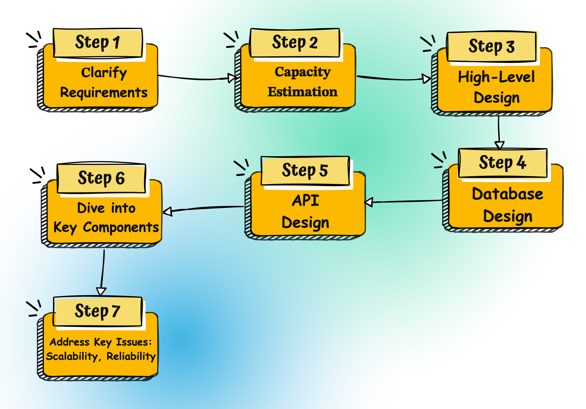
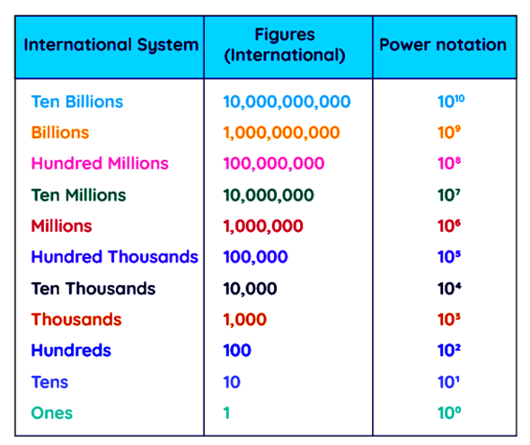
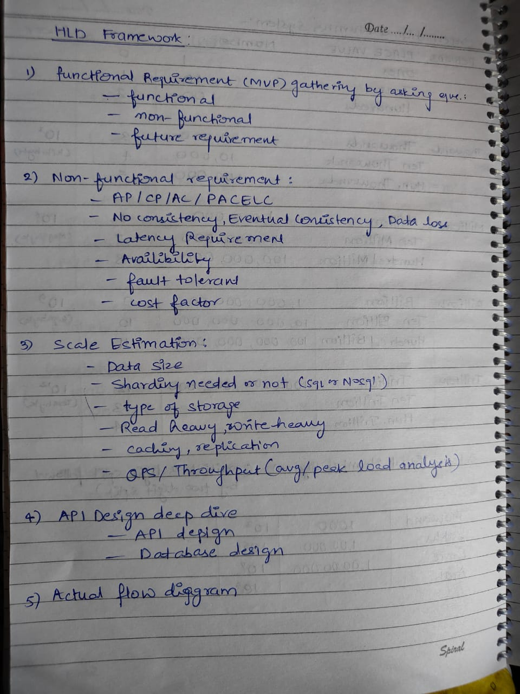
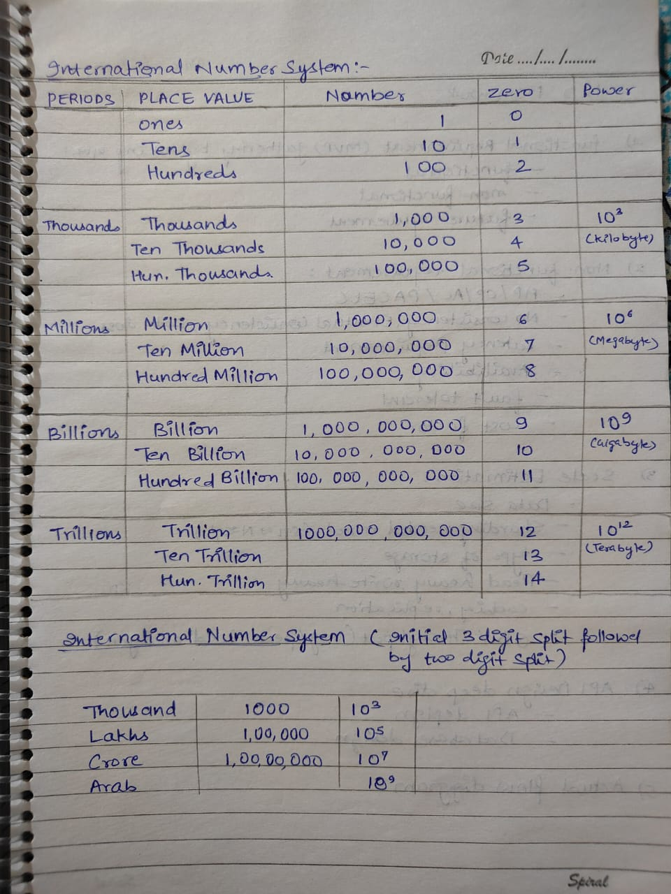
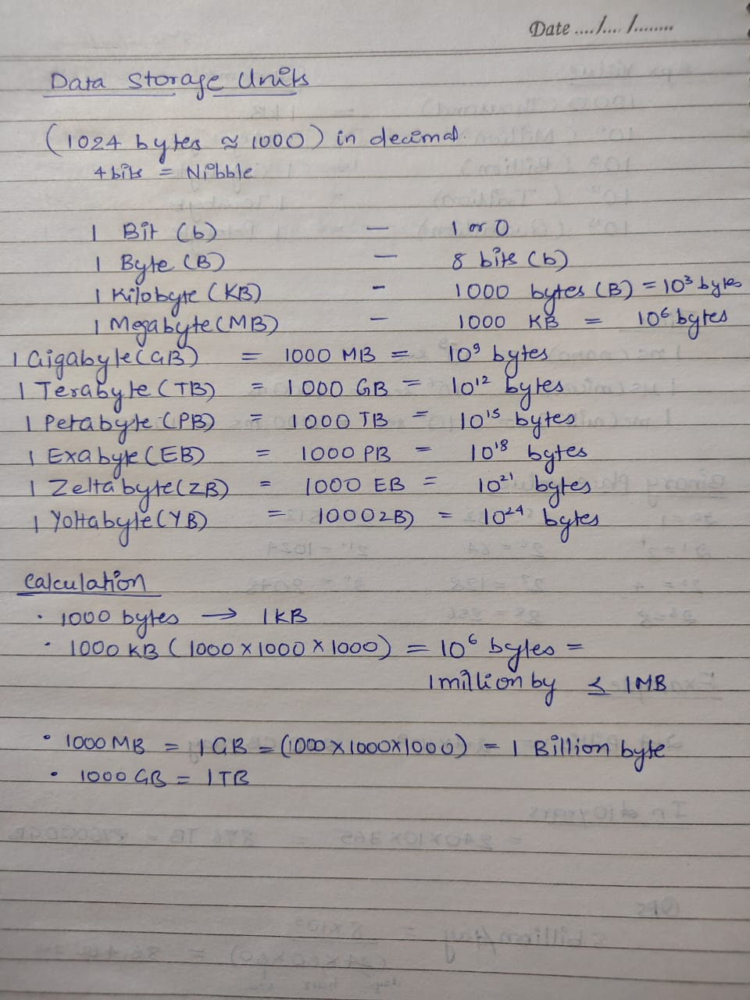
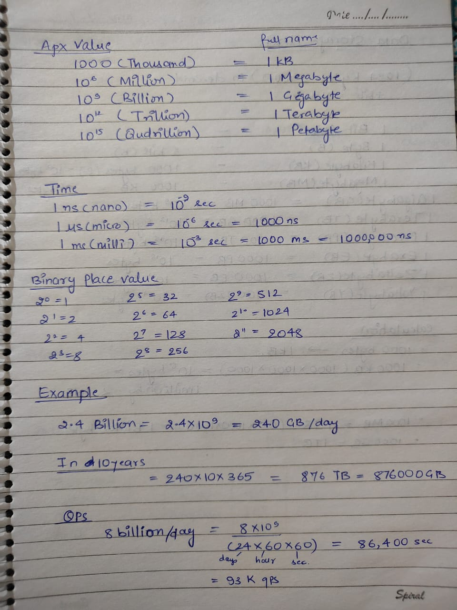

 # High-Level-System-Design
 
 Learn System Design concepts.

#### Tools To Design HLD:
- https://whimsical.com/
- https://lucid.app/
#### Back of the envelop calculation

- [Capacity Estimation](https://systemdesign.one/back-of-the-envelope/)
- [Cheat Sheet](https://systemdesign.one/system-design-interview-cheatsheet/)

## 📌 System Design Key Concepts
- [Scalability](https://blog.algomaster.io/p/scalability)
- [Latency vs Throughput](https://aws.amazon.com/compare/the-difference-between-throughput-and-latency/)
- [CAP Theorem](https://blog.algomaster.io/p/15f1d791-86ce-40ed-8269-962dbddbefdb)
- [ACID Transactions](https://blog.algomaster.io/p/ecae03ba-1930-42ef-8796-83e2fa818989) -ACID properties work in MySQL
- [Consistent Hashing](https://highscalability.com/consistent-hashing-algorithm/)
- [Rate Limiting](https://www.imperva.com/learn/application-security/rate-limiting/)
- [API Design](https://abdulrwahab.medium.com/api-architecture-best-practices-for-designing-rest-apis-bf907025f5f)
- [Strong vs Eventual Consistency](https://hackernoon.com/eventual-vs-strong-consistency-in-distributed-databases-282fdad37cf7)
- [Synchronous vs. asynchronous communications](https://blog.algomaster.io/p/aec1cebf-6060-45a7-8e00-47364ca70761)
- [REST vs RPC](https://aws.amazon.com/compare/the-difference-between-rpc-and-rest/)
- [Batch Processing vs Stream Processing](https://blog.algomaster.io/p/d9442268-03d8-4f55-a103-7a3d4fb54661)
- [Fault Tolerance](https://www.cockroachlabs.com/blog/what-is-fault-tolerance/)
- [Consensus Algorithms](https://medium.com/@sourabhatta1819/consensus-in-distributed-system-ac79f8ba2b8c)
- [Gossip Protocol](http://highscalability.com/blog/2023/7/16/gossip-protocol-explained.html)
- [Service Discovery](https://blog.algomaster.io/p/0204da93-f0e9-49b9-a88a-cb20b9931575)
- [Disaster Recovery](https://cloud.google.com/learn/what-is-disaster-recovery)
- [Distributed Tracing](https://www.dynatrace.com/news/blog/what-is-distributed-tracing/)
- [Top 15 Tradeoffs](https://blog.algomaster.io/p/system-design-top-15-trade-offs)

## 🛠️ System Design Building Blocks
- [Vertical vs Horizontal Scaling](https://blog.algomaster.io/p/system-design-vertical-vs-horizontal-scaling)
- [Databases](https://blog.algomaster.io/p/15-types-of-databases)
- [Content Delivery Network (CDN)](https://www.cloudflare.com/learning/cdn/what-is-a-cdn/)
- [Domain Name System (DNS)](https://www.cloudflare.com/learning/dns/what-is-dns/)
- [Caching](https://medium.com/must-know-computer-science/system-design-caching-acbd1b02ca01)
- [Distributed Caching](https://redis.com/glossary/distributed-caching/)
- [Load Balancing](https://blog.algomaster.io/p/load-balancing-algorithms-explained-with-code)
- [SQL vs NoSQL](https://www.integrate.io/blog/the-sql-vs-nosql-difference/)
- [Database Index](https://blog.algomaster.io/p/a-detailed-guide-on-database-indexes)
- [Consistency Patterns](https://systemdesign.one/consistency-patterns/)
- [HeartBeats](https://blog.algomaster.io/p/heartbeats-in-distributed-systems)
- [Circuit Breaker](https://medium.com/geekculture/design-patterns-for-microservices-circuit-breaker-pattern-276249ffab33)
- [Idempotency](https://blog.dreamfactory.com/what-is-idempotency/)
- [Database Scaling](https://thenewstack.io/techniques-for-scaling-applications-with-a-database/)
- [Data Replication](https://redis.com/blog/what-is-data-replication/)
- [Data Redundancy](https://www.egnyte.com/guides/governance/data-redundancy)
- [Database Sharding](https://blog.algomaster.io/p/what-is-database-sharding)
- [Database Architectures](https://www.mongodb.com/developer/products/mongodb/active-active-application-architectures/)
- [Microservices Guidelines](https://newsletter.systemdesign.one/p/netflix-microservices)
- [Failover](https://avinetworks.com/glossary/failover/)
- [Proxy Server](https://www.fortinet.com/resources/cyberglossary/proxy-server)
- [Message Queues](https://medium.com/must-know-computer-science/system-design-message-queues-245612428a22)
- [WebSockets](https://www.pubnub.com/guides/websockets/)
- [Bloom Filters](https://www.enjoyalgorithms.com/blog/bloom-filter)
- [API Gateway](https://www.nginx.com/learn/api-gateway/)
- [Distributed Locking](https://martin.kleppmann.com/2016/02/08/how-to-do-distributed-locking.html)
- [Checksums](https://blog.algomaster.io/p/what-are-checksums)
- [Distributed Transactions](https://www.youtube.com/watch?v=ET_DnJgfplY)
- [Networking Essential](https://www.youtube.com/watch?v=SHkbPm1Wrno&t=71s&pp=ygUVbmV0d29ya2luZyBlc3NlbnRpYWxz)

## 🖇️ System Design Architectural Patterns
- [Client-Server Architecture](https://www.redswitches.com/blog/client-server-architecture/)
- [Microservices Architecture](https://medium.com/hashmapinc/the-what-why-and-how-of-a-microservices-architecture-4179579423a9)
- [Serverless Architecture](https://www.datadoghq.com/knowledge-center/serverless-architecture/)
- [Event-Driven Architecture](https://www.confluent.io/learn/event-driven-architecture/)
- [Peer-to-Peer (P2P) Architecture](https://www.spiceworks.com/tech/networking/articles/what-is-peer-to-peer/)

## ✅ How to Answer a System Design Interview Problem

  

    
     
    
    
    
    
   
  

   

### [Read the Full Article](https://blog.algomaster.io/p/how-to-answer-a-system-design-interview-problem)

## 💻 System Design Interview Problems
### Easy
- [Design URL Shortener like TinyURL](https://www.youtube.com/watch?v=fMZMm_0ZhK4)
- [Design Text Storage Service like Pastebin](https://www.youtube.com/watch?v=josjRSBqEBI)
- [Design Leaderboard](https://systemdesign.one/leaderboard-system-design/)
- [Design Content Delivery Network (CDN)](https://www.youtube.com/watch?v=8zX0rue2Hic)
- [Design Parking Garage](https://www.youtube.com/watch?v=NtMvNh0WFVM)
- [Design Vending Machine](https://www.youtube.com/watch?v=D0kDMUgo27c)
- [Design Distributed Key-Value Store](https://www.youtube.com/watch?v=rnZmdmlR-2M)
- [Design Distributed Cache](https://www.youtube.com/watch?v=iuqZvajTOyA)
- [Design Distributed Job Scheduler](https://towardsdatascience.com/ace-the-system-design-interview-job-scheduling-system-b25693817950)
- [Design Authentication System](https://www.youtube.com/watch?v=uj_4vxm9u90)
- [Design Unified Payments Interface (UPI)](https://www.youtube.com/watch?v=QpLy0_c_RXk)
### Medium
- [Design Instagram](https://www.youtube.com/watch?v=VJpfO6KdyWE)
- [Design Tinder](https://www.youtube.com/watch?v=tndzLznxq40)
- [Design WhatsApp](https://www.youtube.com/watch?v=vvhC64hQZMk)
  
  [algomaster](https://blog.algomaster.io/p/design-a-chat-application-like-whatsapp),[hellointerview](https://www.hellointerview.com/learn/system-design/problem-breakdowns/whatsapp#1-users-should-be-able-to-start-group-chats-with-multiple-participants-limit-100),[bytebytego](https://bytebytego.com/courses/system-design-interview/design-a-chat-system),[systemdesign](https://systemdesign.one/back-of-the-envelope/)
- [Design Facebook](https://www.youtube.com/watch?v=9-hjBGxuiEs)
- [Design Twitter](https://www.youtube.com/watch?v=wYk0xPP_P_8)
- [Design Reddit](https://www.youtube.com/watch?v=KYExYE_9nIY)
- [Design Netflix](https://www.youtube.com/watch?v=psQzyFfsUGU)
- [Design Youtube](https://www.youtube.com/watch?v=jPKTo1iGQiE)
- [Design Google Search](https://www.youtube.com/watch?v=CeGtqouT8eA)
- [Design E-commerce Store like Amazon](https://www.youtube.com/watch?v=EpASu_1dUdE)
- [Design Spotify](https://www.youtube.com/watch?v=_K-eupuDVEc)
- [Design TikTok](https://www.youtube.com/watch?v=Z-0g_aJL5Fw)
- [Design Shopify](https://www.youtube.com/watch?v=lEL4F_0J3l8)
- [Design Airbnb](https://www.youtube.com/watch?v=YyOXt2MEkv4)
- [Design Autocomplete for Search Engines](https://www.youtube.com/watch?v=us0qySiUsGU)
- [Design Rate Limiter](https://www.youtube.com/watch?v=mhUQe4BKZXs)
- [Design Distributed Message Queue like Kafka](https://www.youtube.com/watch?v=iJLL-KPqBpM)
- [Design Flight Booking System](https://www.youtube.com/watch?v=qsGcfVGvFSs)
- [Design Online Code Editor](https://www.youtube.com/watch?v=07jkn4jUtso)
- [Design Stock Exchange System](https://www.youtube.com/watch?v=dUMWMZmMsVE)
- [Design an Analytics Platform (Metrics & Logging)](https://www.youtube.com/watch?v=kIcq1_pBQSY)
- [Design Notification Service](https://www.youtube.com/watch?v=CUwt9_l0DOg)
- [Design Payment System](https://www.youtube.com/watch?v=olfaBgJrUBI)
- [Design a Digital Wallet](https://www.youtube.com/watch?v=MCKdixWBnco)
- [Design a Hotstar](https://www.scaler.com/academy/mentee-dashboard/class/77835/session)
    [Part 1 Stored Streaming]
   (https://levelup.gitconnected.com/high-level-design-for-a-video-streaming-platform-like-netflix-or-hotstar-part-1-159db2a3ca5d)
   (https://levelup.gitconnected.com/high-level-design-for-a-video-streaming-platform-like-netflix-or-hotstar-part-2-a5c11a33891a)
    [Part 2 -Live Straming](https://blog.bytebytego.com/p/ep139-design-a-live-streaming-system)
    (https://www.geeksforgeeks.org/how-to-design-a-live-video-streaming-system-like-espn/)
    (https://medium.com/@saurabh.codes/system-design-live-streaming-to-millions-1739fc748ef8)
    (https://www.geeksforgeeks.org/design-a-live-streaming-app-like-twitch-system-design/)
    (https://newsletter.systemdesign.one/p/live-streaming-architecture)
   [Part 3]
   (https://zahere.com/designing-a-live-video-streaming-service-like-disney-hotstar)
   (https://www.geeksforgeeks.org/how-disney-hotstar-managed-5-cr-live-viewers-during-indias-t20-world-cup-win/),
   (https://www.youtube.com/watch?v=kebzEEEeGBo)
   (https://www.techaheadcorp.com/blog/decoding-the-incredible-scalability-of-disneyhotstar-app-system-structure-concurrency-more/),
   (https://blog.hotstar.com/scaling-infrastructure-for-millions-from-challenges-to-triumphs-part-1-6099141a99ef)
   (https://blog.bytebytego.com/p/ep139-design-a-live-streaming-system)
   (https://newsletter.systemdesign.one/p/hotstar-architecture)
### Hard
- [Design Location Based Service like Yelp](https://www.youtube.com/watch?v=M4lR_Va97cQ)
- [Design Uber](https://www.hellointerview.com/learn/system-design/problem-breakdowns/uber)
  - [Part 2](https://www.youtube.com/watch?v=M4lR_Va97cQ&t=305s&pp=ygURcHJveGltaXR5IHNlcnZpY2U%3D)
  - [Part 3](https://newsletter.systemdesign.one/p/uber-eta)
- [Design Food Delivery App like Doordash](https://www.youtube.com/watch?v=iRhSAR3ldTw)
- [Design Google Docs](https://www.youtube.com/watch?v=2auwirNBvGg)
- [Design Google Maps](https://www.youtube.com/watch?v=jk3yvVfNvds)
- [Design Zoom](https://www.youtube.com/watch?v=G32ThJakeHk)
- [Design Distributed Counter](https://systemdesign.one/distributed-counter-system-design/)
- [Design File Sharing System like Dropbox](https://www.youtube.com/watch?v=U0xTu6E2CT8)
- [Design Ticket Booking System like BookMyShow](https://www.youtube.com/watch?v=lBAwJgoO3Ek)
- [Design Distributed Web Crawler](https://www.youtube.com/watch?v=BKZxZwUgL3Y)
- [Design Code Deployment System](https://www.youtube.com/watch?v=q0KGYwNbf-0)
- [Design Distributed Cloud Storage like S3](https://www.youtube.com/watch?v=UmWtcgC96X8)
- [Design Distributed Locking Service](https://www.youtube.com/watch?v=v7x75aN9liM)
- [Design Slack](https://systemdesign.one/slack-architecture/)
- [Design Live Comments](https://systemdesign.one/live-comment-system-design/)

## 📜 Must-Read Engineering Articles
- [How Discord stores trillions of messages](https://discord.com/blog/how-discord-stores-trillions-of-messages)
- [Building In-Video Search at Netflix](https://netflixtechblog.com/building-in-video-search-936766f0017c)
- [How Canva scaled Media uploads from Zero to 50 Million per Day](https://www.canva.dev/blog/engineering/from-zero-to-50-million-uploads-per-day-scaling-media-at-canva/)
- [How Airbnb avoids double payments in a Distributed Payments System](https://medium.com/airbnb-engineering/avoiding-double-payments-in-a-distributed-payments-system-2981f6b070bb)
- [Stripe’s payments APIs - The first 10 years](https://stripe.com/blog/payment-api-design)
- [Real time messaging at Slack](https://slack.engineering/real-time-messaging/)

## 🗞️ Must-Read Distributed Systems Papers
- [Paxos: The Part-Time Parliament](https://lamport.azurewebsites.net/pubs/lamport-paxos.pdf)
- [MapReduce: Simplified Data Processing on Large Clusters](https://research.google.com/archive/mapreduce-osdi04.pdf)
- [The Google File System](https://static.googleusercontent.com/media/research.google.com/en//archive/gfs-sosp2003.pdf)
- [Dynamo: Amazon’s Highly Available Key-value Store](https://www.allthingsdistributed.com/files/amazon-dynamo-sosp2007.pdf)
- [Kafka: a Distributed Messaging System for Log Processing](https://notes.stephenholiday.com/Kafka.pdf)
- [Spanner: Google’s Globally-Distributed Database](https://static.googleusercontent.com/media/research.google.com/en//archive/spanner-osdi2012.pdf)
- [Bigtable: A Distributed Storage System for Structured Data](https://static.googleusercontent.com/media/research.google.com/en//archive/bigtable-osdi06.pdf)
- [ZooKeeper: Wait-free coordination for Internet-scale systems](https://www.usenix.org/legacy/event/usenix10/tech/full_papers/Hunt.pdf)
- [The Log-Structured Merge-Tree (LSM-Tree)](https://www.cs.umb.edu/~poneil/lsmtree.pdf)
- [The Chubby lock service for loosely-coupled distributed systems](https://static.googleusercontent.com/media/research.google.com/en//archive/chubby-osdi06.pdf)

## 📚 Books
- [Designing Data-Intensive Applications](https://www.amazon.com/Designing-Data-Intensive-Applications-Reliable-Maintainable/dp/B08VL1BLHB/)
- [System Design Interview – An insider's guide](https://www.amazon.com/System-Design-Interview-insiders-Second/dp/B08CMF2CQF/)

## 📺 YouTube Channels
- [Tech Dummies Narendra L](https://www.youtube.com/@TechDummiesNarendraL)

  Steps:
Requirement
Capacity Esitimation
DB schema
API Design 
Architecture
- [Gaurav Sen](https://www.youtube.com/@gkcs)
- [codeKarle](https://www.youtube.com/@codeKarle)
- [ByteByteGo](https://www.youtube.com/@ByteByteGo)
- [System Design Interview](https://www.youtube.com/@SystemDesignInterview)
- [sudoCODE](https://www.youtube.com/@sudocode)
- [Success in Tech](https://www.youtube.com/@SuccessinTech/videos)
